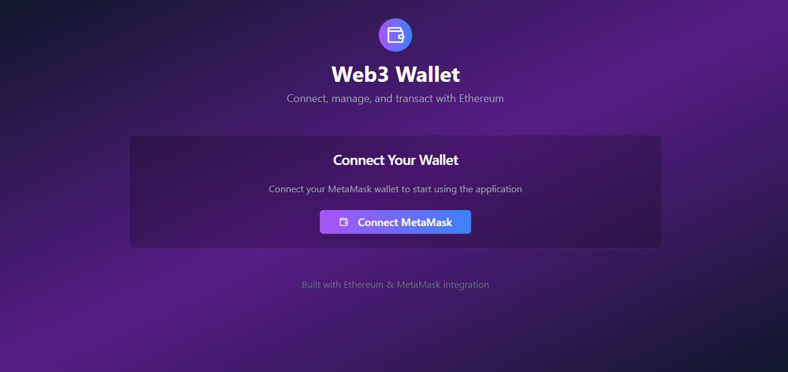

# Welcome to Tx-dApp

# Step 1: Install the necessary dependencies.
npm i

# Step 2: Start the development server with auto-reloading and an instant preview.
npm run dev

## What technologies are used for this project?

This project is built with:

- Vite
- TypeScript
- React
- shadcn-ui
- Tailwind CSS

## features

### ✅ **DApp Features:**

1. **MetaMask Wallet Connection**

   * Detect if MetaMask is installed.
   * Connect user wallet using MetaMask.

2. **Wallet Disconnection**

   * Disconnect and reset wallet state.

3. **Display Connected Wallet Info**

   * Show wallet address.
   * Show wallet balance (in ETH).

4. **Fetch and Refresh Wallet Balance**

   * Fetch ETH balance on connect or refresh.
   * Manual refresh option.

5. **Send ETH Transactions**

   * Input recipient address and amount.
   * Send ETH from connected wallet.
   * Display transaction hash and confirmation status.

6. **Transaction Status Toast Notifications**

   * Real-time feedback on success/failure of actions like connect, send, switch network.

7. **Network Switching**

   * Switch between:

     * Ethereum Mainnet
     * Sepolia Testnet
     * Linea Sepolia Testnet
   * Add unsupported networks to MetaMask.

8. **Auto Network Detection**

   * Detect and validate current network on load.
   * Handle unsupported network error.

9. **Auto Wallet Update Handling**

   * Listen to `accountsChanged` and `chainChanged` events.
   * Update state accordingly.

10. **Transaction History (Component Placeholder)**

* Shows past transactions (assuming `TransactionHistory` is implemented accordingly).

11. **UI Components**

* Header
* Connection Card
* Account Info Card
* Send Transaction Card
* Transaction History Section

12. **Responsive Layout**

* Uses TailwindCSS for responsive design and gradient background.

## 🖼️ App Screenshots

### 🔹 Wallet connection

### 🔹 Account details & Send ETH

### 🔹 Transaction history 

